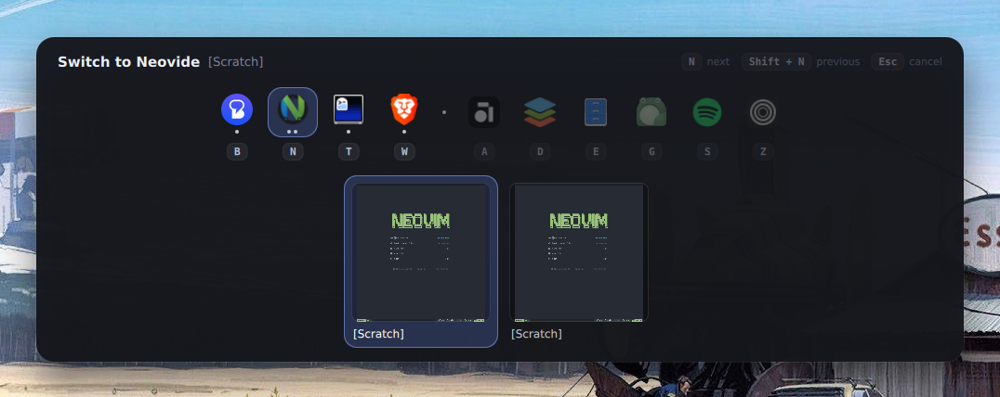

# Raisin 🍇

*Run-or-raise*:

- If the program isn't running: launch it
- If the program is running: jump to one of its windows (and cycle through them if there's more than one)

Intended to be called from a compositor keybinding like so:

- `super + t`: terminal
- `super + w`: web browser
- `super + s`: spotify
- etc...

Currently supports [Niri](https://github.com/YaLTeR/niri) and [Hyprland](https://hyprland.org), but has a small integration layer for adding support for more compositors in the future.

## The switcher

On Hyprland, raisin can show an Alt-Tab style overlay while you hold `Super`. The overlay is drawn
by [Quickshell](https://quickshell.org), which has to be installed (the Nix package brings it
along). Start the daemon once, for example from your Hyprland startup configuration:

```
exec-once = raisin daemon
```



It binds `Super` + a letter for every application in `[keys.apps]`, so adding another letter is a
line of configuration — no compositor configuration to edit, and no restart.

- Tap `Super` + the letter and the window is focused immediately, with nothing on screen.
- Keep `Super` held a moment longer and the switcher appears: every application you gave a key to,
  in a bar with its key under it and a dot per open window, and below that the windows of the one
  you'd get, live, with the one you'd land on highlighted. Applications with nothing open sit
  faintly at the end of the bar so their keys are still to hand; applications you haven't given a
  key to are left out.
- Press the same letter again to cycle through that application's windows, press another mapped
  letter to switch to that application instead, release `Super` to confirm, or press `Esc` to
  cancel.

While the switcher runs it takes those letters over from your own configuration; `hyprctl reload`
gives them back. `Super` and `Escape` are shared rather than taken over: a binding of your own on
`Super` — a launcher on tap, say — keeps working, and Hyprland shadows it by itself while you're
holding `Super` to pick a window.

`raisin switch <app>` does the same thing from a keybinding of your own, and says so plainly if the
switcher isn't running.

Without Quickshell the daemon still binds the keys and switches windows, and says at startup that
there's nothing to draw the overlay with.

## Configuration

Raisin reads `$XDG_CONFIG_HOME/raisin/config.toml` — usually `~/.config/raisin/config.toml` — or
whichever file `raisin daemon --config <path>` names. Every setting has a default, so the file is
optional, and only needs the parts you want to change.

Raisin binds nothing until the file says so: without `[keys.apps]` the switcher runs but no key
does anything.

```toml
[keys]
# These only do something while the switcher is on screen. The rest of the time
# they belong to whatever you're using.
next = "Tab"             # move the highlight on
previous = "SHIFT + Tab" # and back
cancel = "Escape"        # close without switching

# Which letter targets which application, held with Super.
[keys.apps]
t = "ghostty"                                   # Super + t
s = "spotify"
w = { cmd = "brave", app_id = "brave-browser" } # when the window class differs

[switcher]
delay = 90         # milliseconds Super has to stay held before the switcher appears
width = "50%"      # of the screen, or a number of pixels like 900
max_height = "40%" # thumbnails shrink to keep the switcher within this
icons = true       # show each application's icon, rather than its initials

[previews]
enabled = true # show what each window looks like
height = 150   # pixels tall; every thumbnail is, and the width follows the window

# What to call an application, by the window class it uses. Optional: the name
# comes from the application's desktop entry otherwise.
[names]
brave-browser = "Brave"
"com.mitchellh.ghostty" = "Ghostty"
```

An application is named after its desktop entry — `Files`, not `org.gnome.Nautilus` — found by the
window class the entry declares in `StartupWMClass`. Where no entry describes it, raisin falls
back to the title its windows opened under, and then to the class itself.

`[names]` overrides all of that, for when you disagree with the entry: `Zen Browser (Beta)` is a
lot of row to give a browser. The key is the window class, which is the part that doesn't change
as you use the application.

You hold `Super` throughout a switch, so it's implied: `next = "Tab"` means Super and Tab.

Holding `Ctrl` with an application's key runs its `cmd` again, for when the window you want
doesn't exist yet: `Super + Ctrl + t` starts another terminal rather than switching to one. If the
switcher is open it closes, without focusing anything: asking for a new window has answered the
question it was asking.

Holding `Shift` with an application's key walks its windows the other way, the way Alt-Shift-Tab
does. That needs no configuration — and it's why a key that names `Shift` itself doesn't get one:
`"SHIFT + a"` is free only while plain `a` is unmapped, and raisin says so if you map both.

Saving the file is enough: raisin watches it and rebinds straight away, ending any switch that was
in progress under the old keys. Raisin says so on startup when one of its keys is already bound in your Hyprland configuration, and
when two of its own keys are the same key.

A setting the file misspells is an error — at startup it stops the
daemon, and on a reload it leaves the running configuration alone and says what was wrong, since a
half-saved file is a normal thing for an editor to leave behind for a moment.

## Run/install

### Run with Nix

`nix run github:mawkler/raisin -- <app>`

### NixOS

The flake exports a module:

```nix
{
  inputs.raisin.url = "github:mawkler/raisin";

  # ...then, in your configuration:
  imports = [ inputs.raisin.nixosModules.default ];

  services.raisin = {
    enable = true;
    settings.keys.apps = {
      t = "ghostty";
      w = {
        cmd = "brave";
        app_id = "brave-browser";
      };
    };
  };
}
```

The daemon runs as a user service started by `graphical-session.target`, so the session has to reach
systemd: `programs.hyprland.withUWSM = true` does that. Leaving `settings` out keeps your own
`~/.config/raisin/config.toml`, which you can edit without rebuilding.

### Install with cargo

`cargo install --git github:mawkler/raisin`

The switcher also needs Quickshell's `qs` on your `PATH`.

### Working on the switcher's look

The overlay is the QML in `shell/`, built into the binary. To run the daemon on the files in a
checkout instead, so that Quickshell reloads them every time one is saved:

```
RAISIN_SHELL=$PWD/shell raisin daemon
```

## Usage

```help
Run-or-raise for Hyprland and Niri

Usage: raisin <APP> [APP_ID]
       raisin [APP] [APP_ID] <COMMAND>

Commands:
  daemon  Run the switcher. Hyprland only
  switch  Switch to an application through the running switcher
  help    Print this message or the help of the given subcommand(s)

Arguments:
  <APP>
          Command to run the application (e.g., `ghostty`)

  [APP_ID]
          Window app_id to match (e.g., `com.mitchellh.ghostty`). Optional.

          If omitted, the app name is used as a substring to match against window class names.

Options:
  -h, --help
          Print help (see a summary with '-h')

  -V, --version
          Print version

Examples:
  raisin ghostty
  raisin ghostty com.mitchellh.ghostty
  raisin daemon
```
